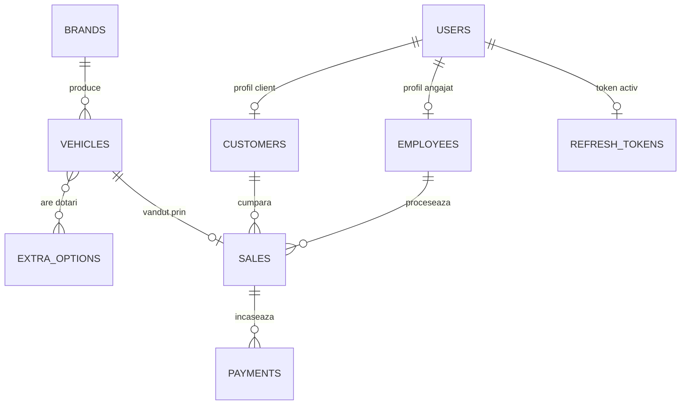

# AutoStart - Aplicație Web pentru Managementul unui Dealership Auto

AutoStart este o aplicație web full-stack pentru digitalizarea operațiunilor dintr-un dealership auto. Platforma acoperă fluxul principal de business: autentificare și administrare utilizatori, management clienți și angajați, inventar vehicule, branduri, opțiuni extra, contracte de vânzare și plăți.

Aplicația a fost migrată dintr-o structură monolitică într-o arhitectură bazată pe microservicii Spring Boot, cu API Gateway, Service Discovery, Config Server, Redis caching și monitorizare prin Prometheus/Grafana.

## Funcționalități principale

- Autentificare cu JWT, refresh token, logout și protecție CSRF.
- Roluri și permisiuni: `ADMIN`, `USER` și autorități bazate pe poziții de angajat.
- CRUD complet pentru utilizatori, clienți, angajați, vehicule, branduri, opțiuni extra, contracte și plăți.
- Paginare și sortare pentru resursele principale.
- Interfață React cu formulare validate client-side și mesaje de eroare prietenoase.
- Validare server-side cu Bean Validation.
- Client users văd doar propriile contracte.
- Cache Redis pentru catalogul de vehicule, branduri și opțiuni.
- Monitorizare cu Spring Boot Actuator, Prometheus și Grafana.
- Configurații externalizate prin Spring Cloud Config Server.
- Service Discovery prin Eureka și load balancing prin Spring Cloud LoadBalancer.

## Tech Stack

### Backend

- Java 21
- Spring Boot 4
- Spring Cloud
- Spring Security
- Spring Data JPA
- Hibernate
- Maven multi-module
- PostgreSQL
- H2 pentru teste
- Redis
- Eureka Server
- Spring Cloud Config Server
- Spring Cloud LoadBalancer
- Spring Boot Actuator
- Micrometer Prometheus
- SLF4J + Logback

### Frontend

- React
- JavaScript
- CSS custom
- Fetch API

### Infrastructură

- Docker / Docker Compose
- Redis containerizat
- Prometheus
- Grafana
- pgAdmin 4 pentru administrarea bazei de date

## Arhitectură

Backend-ul este organizat ca proiect Maven multi-module:

```text
autostart
├── autostart-common
├── auth-user-service
├── vehicle-service
├── sales-service
├── api-gateway
├── discovery-server
└── config-server
```

### Microservicii

| Modul | Port implicit | Responsabilitate |
| --- | ---: | --- |
| `config-server` | `8888` | Configurații centralizate pentru microservicii |
| `discovery-server` | `8761` | Eureka Service Registry |
| `api-gateway` | `8080` | Punct unic de intrare pentru frontend |
| `auth-user-service` | `8081` | Autentificare, utilizatori, clienți, angajați, refresh tokens |
| `vehicle-service` | `8082` | Vehicule, branduri, opțiuni extra, cache catalog |
| `sales-service` | `8083` | Contracte de vânzare și plăți |
| `autostart-common` | - | DTO-uri comune, excepții, JWT, logging, cache, filtre comune |

Frontend-ul comunică doar cu API Gateway:

```text
React Frontend
      |
      v
API Gateway :8080
      |
      +--> auth-user-service :8081
      +--> vehicle-service   :8082
      +--> sales-service     :8083
```

### Comunicare între servicii

- Gateway-ul rutează cererile publice pe baza path-ului.
- `sales-service` comunică intern cu:
  - `auth-user-service` pentru validarea clienților și angajaților.
  - `vehicle-service` pentru validarea vehiculelor și actualizarea statusului la `SOLD`.
- Endpoint-urile interne sunt protejate cu header-ul `X-Internal-Token`.
- Serviciile folosesc nume logice, de exemplu `http://vehicle-service`, prin Eureka + Spring Cloud LoadBalancer.

### Baza de date

Pentru simplitate, aplicația folosește o singură bază PostgreSQL, dar cu scheme separate pe domenii:

| Schema | Tabele |
| --- | --- |
| `auth_user` | `users`, `refresh_tokens`, `customers`, `employees` |
| `vehicle` | `brands`, `vehicles`, `extra_options`, `vehicle_extra_option` |
| `sales` | `sales`, `payments` |

Toate entitățile au mapping explicit cu `@Table(schema = "...")`, astfel încât aplicația nu depinde de schema `public`.

## Model de date

Entitățile principale sunt:

- `User`
- `RefreshToken`
- `Customer`
- `Employee`
- `Brand`
- `Vehicle`
- `ExtraOption`
- `SaleContract`
- `Payment`

Relații implementate:

- `@OneToOne`
  - `User` - `Customer`
  - `User` - `Employee`
  - `User` - `RefreshToken`
- `@OneToMany` / `@ManyToOne`
  - `Brand` - `Vehicle`
  - `SaleContract` - `Payment`
- `@ManyToMany`
  - `Vehicle` - `ExtraOption`, prin tabela `vehicle.vehicle_extra_option`

### Diagramă ER simplificată



Notă: în `sales-service`, contractele păstrează referințe primitive (`customerId`, `employeeId`, `vehicleVin`) pentru a evita relații JPA cross-service. Validarea referințelor se face prin apeluri HTTP interne.

## Setup instructions

### Cerințe locale

- Java 21
- Maven Wrapper inclus în proiect
- Node.js + npm
- Docker Desktop
- PostgreSQL
- pgAdmin 4
- Git Bash sau PowerShell

### Structura proiectului local

```text
autostart-project
├── autostart       # backend microservicii
├── frontend        # aplicația React
└── config-repo     # configurații externalizate pentru Config Server
```

### Configurare PostgreSQL

1. Creați baza de date:

```sql
CREATE DATABASE autostart;
```

2. Creați schemele:

```sql
CREATE SCHEMA IF NOT EXISTS auth_user;
CREATE SCHEMA IF NOT EXISTS vehicle;
CREATE SCHEMA IF NOT EXISTS sales;
```

3. Verificați tabelele după pornirea serviciilor:

```sql
SELECT table_schema, table_name
FROM information_schema.tables
WHERE table_schema IN ('auth_user', 'vehicle', 'sales')
ORDER BY table_schema, table_name;
```

### Variabile de mediu

Configurațiile sensibile trebuie furnizate prin environment variables sau prin fișier local `.env`, nu hardcodate în repository.

Variabile importante:

```env
DB_URL=jdbc:postgresql://localhost:5432/autostart
DB_USER=postgres
DB_PASSWORD=parola_ta
JWT_SECRET=cheie_jwt_lunga_si_sigura_minim_32_caractere
INTERNAL_SERVICE_TOKEN=token_intern_lung_si_sigur
REDIS_HOST=localhost
REDIS_PORT=6379
EUREKA_DEFAULT_ZONE=http://localhost:8761/eureka/
CONFIG_REPO_LOCATION=file:///E:/CODING/laburi java master/autostart-project/config-repo
```

### Pornire infrastructură Docker

Din folderul `autostart`:

```bash
docker compose up -d redis
docker compose -f docker-compose.monitoring.yml up -d
```

Servicii Docker:

- Redis: `localhost:6379`
- Prometheus: `http://localhost:9090`
- Grafana: `http://localhost:3001`

Credentiale Grafana implicite:

```text
user: admin
password: admin
```

### Pornire backend

Din folderul `autostart`, porniți serviciile în această ordine:

```bash
./mvnw.cmd -pl config-server spring-boot:run
./mvnw.cmd -pl discovery-server spring-boot:run
./mvnw.cmd -pl auth-user-service spring-boot:run
./mvnw.cmd -pl vehicle-service spring-boot:run
./mvnw.cmd -pl sales-service spring-boot:run
./mvnw.cmd -pl api-gateway spring-boot:run
```

Verificări utile:

- Config Server: `http://localhost:8888`
- Eureka: `http://localhost:8761`
- Gateway health: `http://localhost:8080/actuator/health`
- Auth health: `http://localhost:8081/actuator/health`
- Vehicle health: `http://localhost:8082/actuator/health`
- Sales health: `http://localhost:8083/actuator/health`
- Prometheus target status: `http://localhost:9090/targets`

### Pornire frontend

Din folderul `frontend`:

```bash
npm install
npm.cmd start
```

Frontend-ul rulează la:

```text
http://localhost:3000
```

API base URL implicit:

```text
http://localhost:8080/api/v1
```

### Rulare teste

Backend:

```bash
cd autostart
./mvnw.cmd test
```

Frontend:

```bash
cd frontend
npm.cmd test -- --watchAll=false
npm.cmd run build
```

## Configurare multi-environment

Aplicația are profiluri separate:

- `dev`: PostgreSQL, Redis, Config Server, Eureka.
- `test`: H2 in-memory și cache simplu în memorie, fără dependență de Redis/Docker.

Fișiere relevante:

- `application.yaml`
- `application-dev.yaml`
- `application-test.yaml`
- `config-repo/*.yml`

## API documentation

Toate endpoint-urile publice sunt accesate prin API Gateway:

```text
http://localhost:8080/api/v1
```

### Auth

| Metodă | Endpoint | Descriere |
| --- | --- | --- |
| `GET` | `/auth/csrf` | Returnează token CSRF |
| `POST` | `/auth/login` | Autentificare utilizator |
| `POST` | `/auth/register` | Înregistrare utilizator |
| `POST` | `/auth/refresh` | Reînnoire access token |
| `POST` | `/auth/logout` | Logout și invalidare refresh token |

### Utilizatori, clienți, angajați

| Metodă | Endpoint | Descriere |
| --- | --- | --- |
| `GET` | `/users` | Listare paginată utilizatori |
| `GET` | `/users/{id}` | Detalii utilizator |
| `POST` | `/users` | Creare utilizator |
| `PUT` | `/users/{id}` | Actualizare utilizator |
| `DELETE` | `/users/{id}` | Ștergere utilizator |
| `GET` | `/customers` | Listare clienți |
| `POST` | `/customers` | Creare profil client |
| `PUT` | `/customers/{id}` | Actualizare client |
| `DELETE` | `/customers/{id}` | Ștergere client |
| `GET` | `/employees` | Listare angajați |
| `POST` | `/employees` | Creare profil angajat |
| `PUT` | `/employees/{id}` | Actualizare angajat |
| `DELETE` | `/employees/{id}` | Ștergere angajat |

### Vehicule, branduri, opțiuni

| Metodă | Endpoint | Descriere |
| --- | --- | --- |
| `GET` | `/vehicles` | Listare paginată vehicule |
| `GET` | `/vehicles/{vin}` | Detalii vehicul |
| `POST` | `/vehicles` | Creare vehicul |
| `PUT` | `/vehicles/{vin}` | Actualizare vehicul |
| `DELETE` | `/vehicles/{vin}` | Ștergere vehicul |
| `GET` | `/brands` | Listare branduri |
| `POST` | `/brands` | Creare brand |
| `PUT` | `/brands/{id}` | Actualizare brand |
| `DELETE` | `/brands/{id}` | Ștergere brand |
| `GET` | `/extra-options` | Listare opțiuni extra |
| `POST` | `/extra-options` | Creare opțiune extra |
| `PUT` | `/extra-options/{id}` | Actualizare opțiune extra |
| `DELETE` | `/extra-options/{id}` | Ștergere opțiune extra |

### Contracte și plăți

| Metodă | Endpoint | Descriere |
| --- | --- | --- |
| `GET` | `/sale-contracts` | Listare contracte pentru admin/angajați autorizați |
| `GET` | `/sale-contracts/my` | Contractele clientului autentificat |
| `GET` | `/sale-contracts/{id}` | Detalii contract |
| `POST` | `/sale-contracts` | Creare contract |
| `PUT` | `/sale-contracts/{id}` | Actualizare contract |
| `DELETE` | `/sale-contracts/{id}` | Ștergere contract |
| `GET` | `/payments` | Listare plăți |
| `POST` | `/payments` | Creare plată |
| `PUT` | `/payments/{id}` | Actualizare plată |
| `DELETE` | `/payments/{id}` | Ștergere plată |

### Paginare și sortare

Endpoint-urile de listare acceptă parametri:

```text
page=0
size=10
sortBy=name
direction=asc
```

Exemplu:

```text
GET /api/v1/vehicles?page=0&size=10&sortBy=vin&direction=asc
```

### Endpoint-uri interne

Endpoint-urile interne nu sunt apelate direct din frontend. Ele necesită `X-Internal-Token`.

| Serviciu | Endpoint | Scop |
| --- | --- | --- |
| `auth-user-service` | `/api/internal/customers/{id}/exists` | Verifică existența unui client |
| `auth-user-service` | `/api/internal/employees/{id}/exists` | Verifică existența unui angajat |
| `auth-user-service` | `/api/internal/customers/by-email/{email}/id` | Găsește customer id pentru user-ul autentificat |
| `vehicle-service` | `/api/internal/vehicles/{vin}/exists` | Verifică existența unui vehicul |
| `vehicle-service` | `/api/internal/vehicles/{vin}/status` | Actualizează statusul vehiculului |

## Securitate

- Autentificare prin JWT.
- Refresh tokens persistate în baza de date.
- Remember-me prin durată extinsă pentru refresh token.
- Parole hash-uite cu BCrypt.
- CSRF activ cu `CookieCsrfTokenRepository`.
- CORS configurat pentru frontend.
- Endpoint-uri protejate cu `@PreAuthorize`.
- Serviciile downstream validează JWT fără a interoga baza auth-user pentru fiecare request.
- Comunicarea internă între servicii este protejată cu `X-Internal-Token`.

## Redis și caching

Redis este folosit ca bază NoSQL/cache distribuit.

Configurare:

- Container Docker `redis:7-alpine`.
- Port `6379`.
- Politică memorie: `allkeys-lru`.
- TTL cache: 10 minute.
- Chei serializate cu `StringRedisSerializer`.
- Valori serializate JSON.

Cache-uri principale:

| Cache | Conținut |
| --- | --- |
| `vehicle::...` | Liste și detalii vehicule |
| `brands::...` | Liste și detalii branduri |
| `options::...` | Liste și detalii opțiuni extra |

Invalidarea cache-ului se face automat prin `@CacheEvict` pe operații `POST`, `PUT`, `DELETE`.

Comenzi demo:

```bash
docker exec -it autostart-redis redis-cli FLUSHALL
docker exec -it autostart-redis redis-cli KEYS "*"
docker exec -it autostart-redis redis-cli INFO stats
```

## Monitorizare și metrici

Fiecare microserviciu expune endpoint-uri Actuator:

```text
/actuator/health
/actuator/prometheus
```

Prometheus scrape-uiește serviciile backend, iar Grafana folosește Prometheus ca datasource.

Fișiere relevante:

- `docker-compose.monitoring.yml`
- `monitoring/prometheus/prometheus.yml`
- `monitoring/grafana/provisioning/datasources/prometheus.yml`

## Logging și tratarea erorilor

- Logging prin SLF4J + Logback.
- Configurație separată `logback-spring.xml` în servicii.
- Logging pentru request-uri prin `RequestLoggingFilter`.
- Logging pentru metode prin aspect comun.
- Erorile sunt normalizate prin `GlobalExceptionHandler`.
- Răspunsurile de eroare includ status, mesaj, path și erori de validare.

## Screenshots

### Interfață AutoStart


### Ecrane recomandate pentru prezentare

Pentru predare/prezentare, pot fi adăugate capturi suplimentare în această secțiune:

- Login custom.
- Dashboard admin/manager.
- Inventar vehicule cu paginare și sortare.
- Formular adăugare client/angajat cu autofill.
- Contractele vizibile pentru un utilizator client.
- Eureka Dashboard cu serviciile înregistrate.
- Prometheus Targets.
- Grafana Dashboard.
- Redis keys pentru `vehicle::`, `brands::`, `options::`.

## Demo rapid

1. Porniți Redis, Prometheus și Grafana.
2. Porniți Config Server și Eureka.
3. Porniți cele trei microservicii și API Gateway.
4. Deschideți frontend-ul.
5. Autentificați-vă ca admin/manager.
6. Demonstrați CRUD, paginare, sortare, validare și roluri.
7. Autentificați-vă ca user client și arătați că vede doar contractele proprii.
8. Deschideți Eureka pentru service discovery.
9. Arătați Redis keys după accesarea catalogului.
10. Arătați Prometheus/Grafana pentru monitorizare.

## Testare

Backend:

```bash
./mvnw.cmd test
```

Frontend:

```bash
npm.cmd test -- --watchAll=false
npm.cmd run build
```

Testele folosesc profilul `test`, H2 in-memory și cache local, astfel încât nu depind de PostgreSQL sau Redis.

## Repository și branch strategy

Proiectul este împărțit în două repository-uri:

- Backend: `autostart`
- Frontend: `frontend`

Strategie recomandată:

- `main`: versiune stabilă.
- `dev` / branch de etapă: integrare funcționalități.
- branch-uri de feature pentru task-uri mari: microservicii, Redis, monitoring, frontend polish.

## Contribuții membrii echipei

### Bărboi Sabin

- Implementare și integrare frontend React.
- Pagini de management pentru resurse, formulare, validare client-side.
- Integrare API Gateway cu frontend-ul.
- Flux client-only pentru vizualizarea contractelor proprii.
- Ajustări UI pentru prezentare, afișare EUR și experiență pe roluri.
- Testare manuală a fluxurilor end-to-end.

### Ichim Vlad

- Implementare backend Spring Boot și migrare la microservicii.
- Model de date, entități JPA, repository-uri și service layer.
- Configurare Spring Security, JWT, CSRF și roluri.
- Integrare PostgreSQL cu scheme separate.
- Configurare Eureka, Config Server, LoadBalancer și API Gateway.
- Integrare Redis caching, Actuator, Prometheus și Grafana.

## Autori

- Bărboi Sabin
- Ichim Vlad
